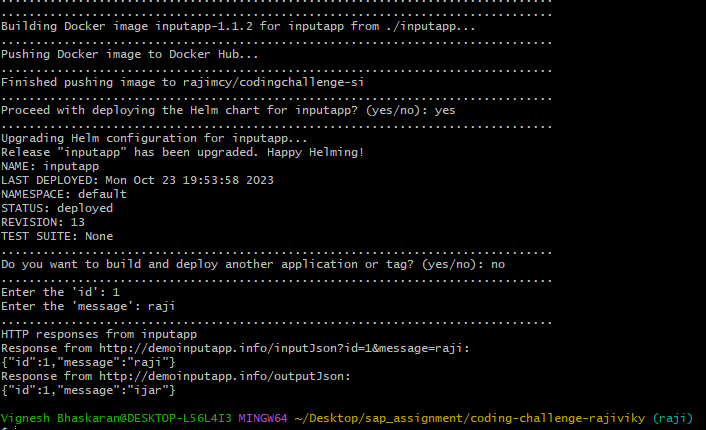

# About
This repo contains the Devops Infra Code challenge

## Dear applicant
Please see and follow instructions in [challenge.md](./challenge.md)

## Dear code challenge operator
To create the Code Challenge, follow the instruction in [README.md](https://github.com/signavio/hiring-tools/blob/master/README.md).
To evaluate the code challenge, you can use [this tool](https://github.com/signavio/grizzlies/blob/master/tools/evaluate_code_challenge/README.md).

## Screenshots from working demo of the applications
Screenshots of accessing application from browser

Screenshot of build and deploy using script.sh

 

Kubernetes services deployed in minikube

